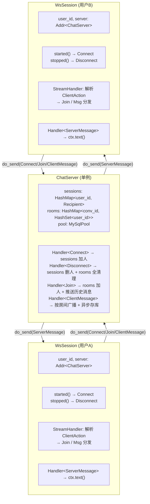
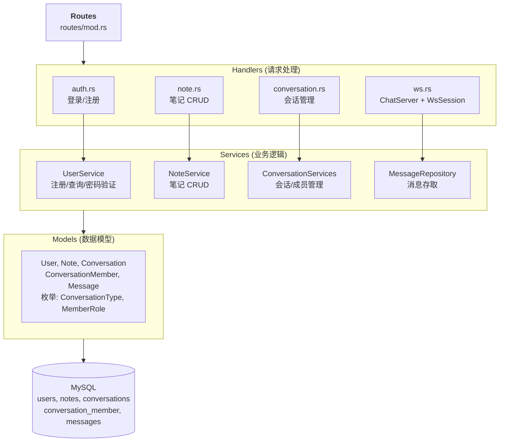
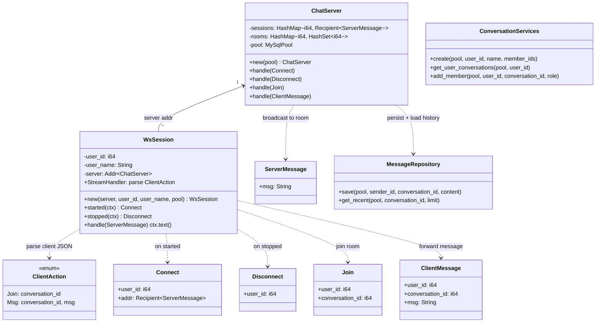
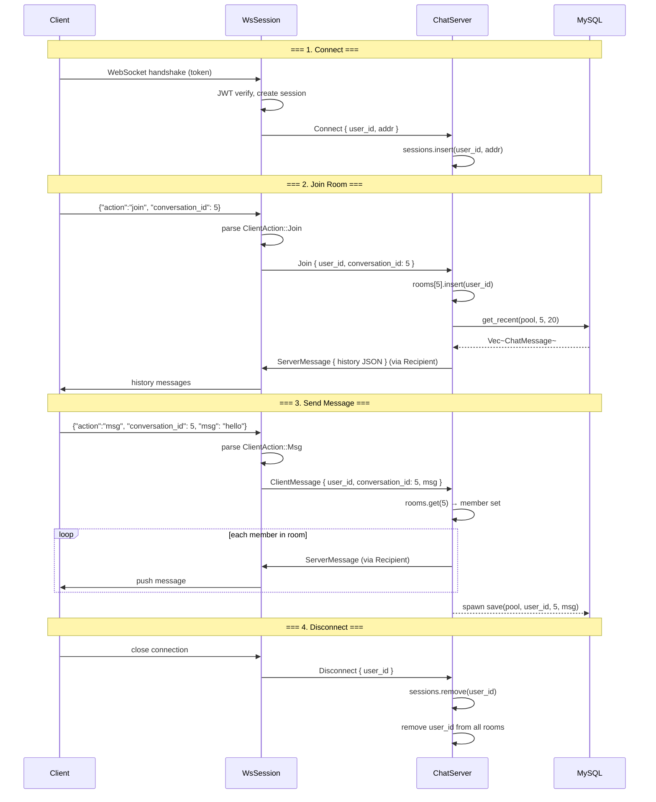

# Chat Architecture

## Overview

Easynote 的聊天系统基于 **Actix Actor 模型**，通过消息驱动实现 WebSocket 实时通信和房间隔离广播。

### 技术栈
- **Actix-web** — HTTP 框架 + WebSocket 握手
- **Actix Actor** — ChatServer（单例协调者）+ WsSession（每用户一个）
- **sqlx + MySQL** — 消息持久化 + 会话管理
- **serde** — JSON 序列化/反序列化（客户端协议）

---

## Actor 架构



---

## 消息类型

### Actor 消息（内部通信）

| 消息 | 方向 | 字段 | 作用 |
|------|------|------|------|
| `Connect` | WsSession → ChatServer | user_id, addr | 注册在线用户 |
| `Disconnect` | WsSession → ChatServer | user_id | 注销用户 + 清理所有房间 |
| `Join` | WsSession → ChatServer | user_id, conversation_id | 加入房间 + 推送历史消息 |
| `ClientMessage` | WsSession → ChatServer | user_id, conversation_id, msg | 房间广播 + 消息持久化 |
| `ServerMessage` | ChatServer → WsSession | msg (JSON string) | 推送消息给客户端 |

### 客户端协议（WebSocket JSON）

客户端发送：
```json
{"action": "join", "conversation_id": 5}
{"action": "msg", "conversation_id": 5, "msg": "你好"}
```

对应 Rust 枚举（serde tag 自动分发）：
```rust
#[derive(Deserialize)]
#[serde(tag = "action")]
enum ClientAction {
    #[serde(rename = "join")]
    Join { conversation_id: i64 },
    #[serde(rename = "msg")]
    Msg { conversation_id: i64, msg: String },
}
```

---

## 数据流

### 连接 + 加入房间
```
Client → WebSocket握手(token) → JWT验证 → 创建WsSession
  WsSession::started() → Connect { user_id, addr } → ChatServer
  Client → {"action":"join","conversation_id":5}
    → WsSession 解析为 ClientAction::Join
    → Join { user_id, conversation_id } → ChatServer
    → rooms[5].insert(user_id)
    → actix::spawn: get_recent(5, 20) → 逐条发 ServerMessage → Client
```

### 发送消息
```
Client → {"action":"msg","conversation_id":5,"msg":"你好"}
  → WsSession 解析为 ClientAction::Msg
  → ClientMessage { user_id, conversation_id:5, msg } → ChatServer
  → rooms.get(5) 拿到成员集合
  → 遍历成员, sessions.get(user_id) 拿 Recipient
  → recipient.do_send(ServerMessage) → WsSession → Client
  → actix::spawn: save(pool, user_id, 5, msg) → MySQL
```

### 断开连接
```
Client 关闭连接
  → WsSession::stopped() → Disconnect { user_id } → ChatServer
  → sessions.remove(user_id)
  → 遍历所有 rooms, remove(user_id)
```

---

## HTTP API

### 认证
| 方法 | 路径 | 说明 | 认证 |
|------|------|------|------|
| POST | `/login` | 登录，返回 JWT token | 无 |
| POST | `/register` | 注册新用户 | 无 |

### 笔记
| 方法 | 路径 | 说明 | 认证 |
|------|------|------|------|
| GET | `/notes` | 获取我的笔记列表 | JWT |
| POST | `/notes` | 创建笔记 | JWT |
| GET | `/notes/{id}` | 获取单个笔记 | JWT |
| PUT | `/notes/{id}` | 更新笔记 | JWT |
| DELETE | `/notes/{id}` | 删除笔记 | JWT |

### 会话
| 方法 | 路径 | 说明 | 认证 |
|------|------|------|------|
| POST | `/conversations` | 创建会话 | JWT |
| GET | `/conversations` | 获取我的会话列表 | JWT |
| POST | `/conversations/{id}/members` | 添加成员 | JWT |

### WebSocket
| 路径 | 参数 | 说明 |
|------|------|------|
| `/ws?token=xxx` | JWT token (query param) | WebSocket 连接入口 |

---

## 分层架构



---

## Class Diagram



## Sequence Diagram



---

## 待完成

- [ ] 群聊创建逻辑 (create 中 members_num > 1 分支)
- [ ] Leave 消息 (退出房间但不断开连接)
- [ ] 清理未使用的 import 和 warning
- [ ] 消息格式增强 (ServerMessage 加 type 字段区分聊天/历史/系统消息)
- [ ] 生产环境配置 (CORS 限制、JWT_SECRET 更换)
