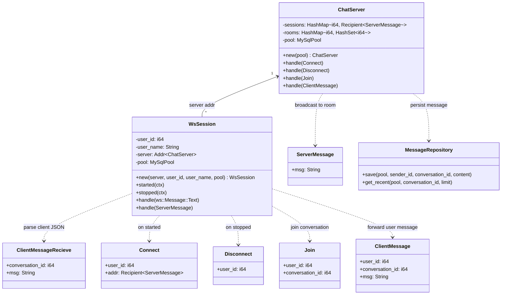
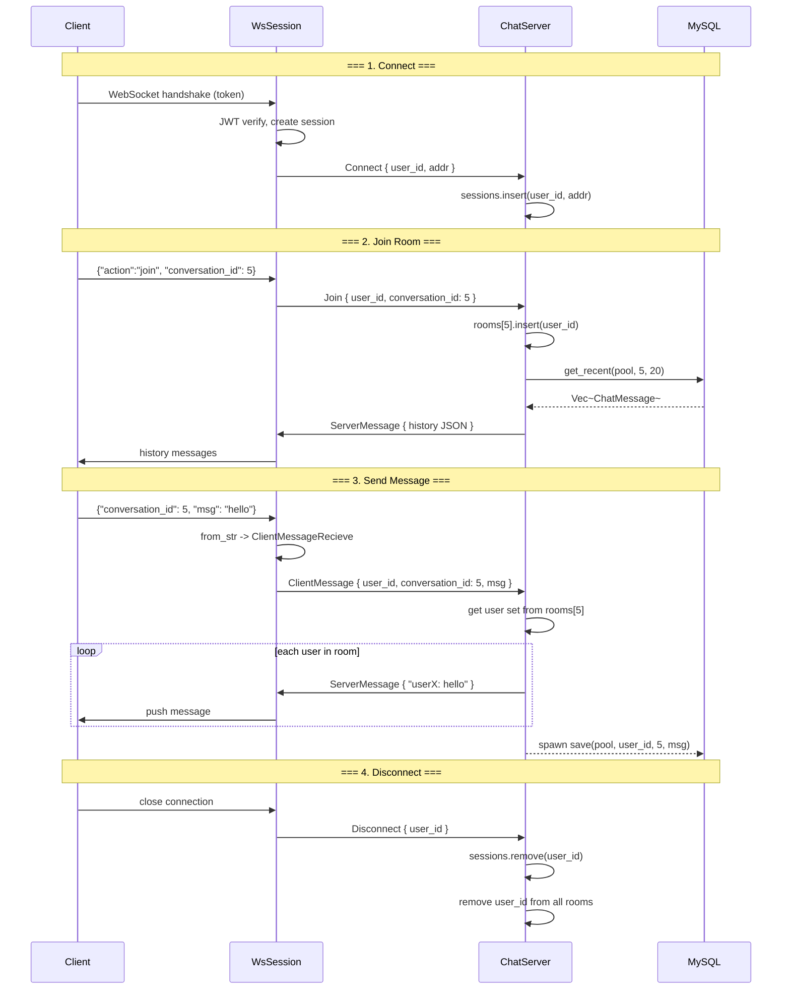

# Chat Architecture UML

## Class Diagram

```mermaid
classDiagram
    class ChatServer {
        -sessions: HashMap~i64, Recipient~ServerMessage~~
        -rooms: HashMap~i64, HashSet~i64~~
        -pool: MySqlPool
        +new(pool) ChatServer
        +handle(Connect)
        +handle(Disconnect)
        +handle(Join)
        +handle(ClientMessage)
    }

    class WsSession {
        -user_id: i64
        -user_name: String
        -server: Addr~ChatServer~
        -pool: MySqlPool
        +new(server, user_id, user_name, pool) WsSession
        +started(ctx)
        +stopped(ctx)
        +handle(ws::Message::Text)
        +handle(ServerMessage)
    }

    class Connect {
        +user_id: i64
        +addr: Recipient~ServerMessage~
    }

    class Disconnect {
        +user_id: i64
    }

    class Join {
        +user_id: i64
        +conversation_id: i64
    }

    class ClientMessage {
        +user_id: i64
        +conversation_id: i64
        +msg: String
    }

    class ServerMessage {
        +msg: String
    }

    class ClientMessageRecieve {
        +conversation_id: i64
        +msg: String
    }

    class MessageRepository {
        +save(pool, sender_id, conversation_id, content)
        +get_recent(pool, conversation_id, limit)
    }

    ChatServer "1" <-- "*" WsSession : server addr
    WsSession ..> ClientMessageRecieve : parse client JSON
    WsSession ..> Connect : on started
    WsSession ..> Disconnect : on stopped
    WsSession ..> Join : join conversation
    WsSession ..> ClientMessage : forward user message
    ChatServer ..> ServerMessage : broadcast to room
    ChatServer ..> MessageRepository : persist message
```

## Sequence Diagram

```mermaid
sequenceDiagram
    participant C as Client
    participant WS as WsSession
    participant CS as ChatServer
    participant DB as MySQL

    Note over C,DB: === 1. Connect ===
    C->>WS: WebSocket handshake (token)
    WS->>WS: JWT verify, create session
    WS->>CS: Connect { user_id, addr }
    CS->>CS: sessions.insert(user_id, addr)

    Note over C,DB: === 2. Join Room ===
    C->>WS: {"action":"join", "conversation_id": 5}
    WS->>CS: Join { user_id, conversation_id: 5 }
    CS->>CS: rooms[5].insert(user_id)
    CS->>DB: get_recent(pool, 5, 20)
    DB-->>CS: Vec~ChatMessage~
    CS->>WS: ServerMessage { history JSON }
    WS->>C: history messages

    Note over C,DB: === 3. Send Message ===
    C->>WS: {"conversation_id": 5, "msg": "hello"}
    WS->>WS: from_str -> ClientMessageRecieve
    WS->>CS: ClientMessage { user_id, conversation_id: 5, msg }
    CS->>CS: get user set from rooms[5]
    loop each user in room
        CS->>WS: ServerMessage { "userX: hello" }
        WS->>C: push message
    end
    CS-->>DB: spawn save(pool, user_id, 5, msg)

    Note over C,DB: === 4. Disconnect ===
    C->>WS: close connection
    WS->>CS: Disconnect { user_id }
    CS->>CS: sessions.remove(user_id)
    CS->>CS: remove user_id from all rooms
```
